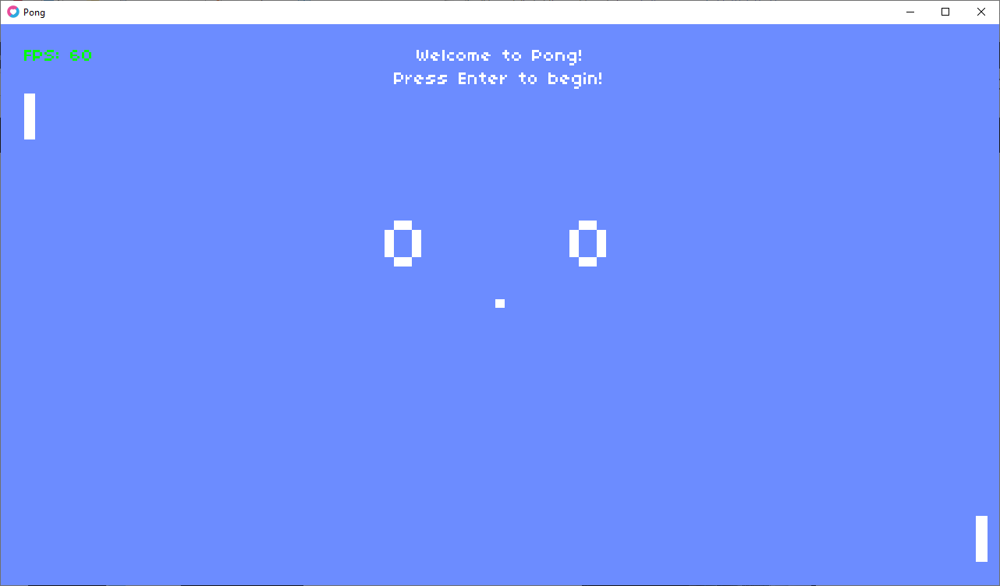

[](http://opensource.org/licenses/MIT)
[](http://hits.dwyl.io/SharkDemon/pongo)

# pongo

Pongo is a Pong remake implemented in Lua, using [Love](https://love2d.org/) (the 2D game engine).

## Screenshot



## Running the program (Windows)

Typically I install Love to one of my tools directories, create a LOVE_HOME environment variable, and set that environment variable to the Love installation directory.

Then I navigate to the project folder and setup a batch file containing the following command:

```
"%LOVE_HOME:\=/%/love.exe" --console "%cd:\=/%"
```
